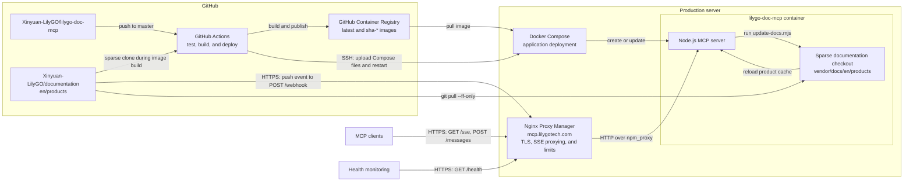

# lilygo-doc-mcp

English | [简体中文](README_CN.md)

MCP server for [LILYGO](https://www.lilygo.cc) product documentation. Exposes LILYGO hardware docs as structured tools for LLM clients via the [Model Context Protocol](https://modelcontextprotocol.io).

Documentation is served from a local sparse git checkout of [Xinyuan-LilyGO/documentation](https://github.com/Xinyuan-LilyGO/documentation). No runtime GitHub API calls — zero rate limit issues. Docs can stay up to date automatically via a GitHub webhook.

## Hosted service

The production service is available at these public endpoints:

| Endpoint | Method | Description |
|----------|--------|-------------|
| [https://mcp.lilygotech.com/sse](https://mcp.lilygotech.com/sse) | `GET` | MCP SSE connection endpoint used by MCP clients. |
| [https://mcp.lilygotech.com/health](https://mcp.lilygotech.com/health) | `GET` | Health endpoint returning `{ status, products }`. |
| [https://mcp.lilygotech.com/webhook](https://mcp.lilygotech.com/webhook) | `POST` | GitHub push webhook used to update the documentation checkout. |

Connect an MCP client to the hosted service with:

```json
{
  "mcpServers": {
    "lilygo-docs": {
      "type": "sse",
      "url": "https://mcp.lilygotech.com/sse"
    }
  }
}
```

The SSE transport advertises a session-specific `https://mcp.lilygotech.com/messages?sessionId=...` endpoint automatically. MCP clients manage that endpoint; do not configure or call it manually.

The webhook URL is public but accepts GitHub `POST` requests only. Configure `GITHUB_WEBHOOK_SECRET` and use the same value in the GitHub webhook settings before exposing it; when the variable is empty, signature verification is skipped.

## Architecture



GitHub Actions deploys the MCP application but does not deploy Nginx Proxy Manager; the production server must provide NPM and the external `npm_proxy` network. A valid push webhook returns `202 Accepted`, then the server updates the sparse checkout and reloads its in-memory product cache asynchronously.

## Quick start

### 1. Clone and install

```bash
git clone https://github.com/Xinyuan-LilyGO/lilygo-doc-mcp.git
cd lilygo-doc-mcp
npm install
npm run docs:init
npm run build
```

`npm run docs:init` clones only the `en/products` documentation subtree into `vendor/docs`.

To point at another docs checkout, set `DOCS_REPO_DIR` before running the command:

```bash
DOCS_REPO_DIR=/path/to/documentation npm run docs:update
```

### 2. Start the server

```bash
PORT=3000 npm start
```

### 3. Connect your MCP client

```json
{
  "mcpServers": {
    "lilygo-docs": {
      "type": "sse",
      "url": "http://localhost:3000/sse"
    }
  }
}
```

## Keeping docs up to date

### Manual update

```bash
npm run docs:update
```

Then restart the server (or let the webhook do it automatically).

### Automatic via GitHub webhook

Set up a webhook on the [Xinyuan-LilyGO/documentation](https://github.com/Xinyuan-LilyGO/documentation) repository:

1. Go to **Settings → Webhooks → Add webhook**
2. Set **Payload URL** to `https://mcp.lilygotech.com/webhook` (or the corresponding URL for a self-hosted domain)
3. Set **Content type** to `application/json`
4. Set **Secret** to the exact value configured as `GITHUB_WEBHOOK_SECRET` on the server
5. Choose **Just the push event**

Start the server with the webhook secret:

```bash
GITHUB_WEBHOOK_SECRET=your-secret PORT=3000 npm start
```

Do not expose `/webhook` with an empty `GITHUB_WEBHOOK_SECRET`, because the server skips signature verification when no secret is configured.

On every push to the documentation repo, the server will:
1. Run `node scripts/update-docs.mjs`
2. Reload the in-memory product cache. Product categories are discovered automatically.

## Logging

The server logs MCP SSE connections, message requests, disconnections, and tool calls. Tool-call logs include the tool name and arguments, but not returned document content.

Follow logs from Docker with:

```bash
docker logs -f lilygo-doc-mcp
```

## Tools

| Tool | Description |
|------|-------------|
| `list_products` | List all products, filter by series / tags / keyword |
| `get_product` | Get full docs plus the programming guide, or a specific section (overview, quickstart, features, parameters, pins, faq) |
| `get_product_guide` | Get the dedicated `quick-start.md` programming guide, including SDK setup, dependencies, and code examples |
| `search_products` | Full-text search across product pages and programming guides with ranked excerpts |
| `get_product_specs` | Extract structured specs: key features, parameter table, pin tables |

## Environment variables

| Variable | Default | Description |
|----------|---------|-------------|
| `PORT` | `3000` | HTTP server port |
| `GITHUB_WEBHOOK_SECRET` | _(empty)_ | GitHub webhook secret for signature verification. If unset, signature check is skipped. |
| `DOCS_DIR` | `vendor/docs/en/products` | Path to local documentation directory |
| `DOCS_REPO_DIR` | `vendor/docs` | Path to the local documentation git checkout updated by `docs:init`, `docs:update`, and webhook pushes |
| `DOCS_REPO_URL` | `https://github.com/Xinyuan-LilyGO/documentation.git` | Documentation repository URL |
| `DOCS_REPO_BRANCH` | `master` | Documentation repository branch |
| `DOCS_SPARSE_PATH` | `en/products` | Sparse checkout path to serve |

## Docker deployment

Both deployment methods require Docker Engine with the Docker Compose plugin. Clone this repository on the server before following either method.

### Option 1: standalone deployment

Use this method for local-only access, direct LAN access, or when an external reverse proxy is not required. It uses only `compose.yaml` and creates a private Docker network automatically. It does not provide TLS termination.

Create the runtime configuration:

```bash
git clone https://github.com/Xinyuan-LilyGO/lilygo-doc-mcp.git
cd lilygo-doc-mcp
cp .env.example .env
```

Edit `.env` before starting the service:

```dotenv
LILYGO_DOC_MCP_IMAGE=ghcr.io/xinyuan-lilygo/lilygo-doc-mcp:latest
LILYGO_DOC_MCP_BIND_ADDRESS=127.0.0.1
LILYGO_DOC_MCP_PORT=3000
GITHUB_WEBHOOK_SECRET=replace-with-a-random-secret
```

- Keep `LILYGO_DOC_MCP_BIND_ADDRESS=127.0.0.1` when only software on the same server needs access.
- Set it to `0.0.0.0` only when direct LAN access is intentional and the host firewall restricts access appropriately.
- Replace `GITHUB_WEBHOOK_SECRET` with a strong random value before exposing `/webhook`.

For example, generate a 32-byte hexadecimal secret and place the output in `.env`:

```bash
openssl rand -hex 32
```

Pull and start the service:

```bash
docker compose pull
docker compose up -d --wait
```

Verify the health endpoint and inspect the service state:

```bash
curl http://127.0.0.1:3000/health
docker compose ps
docker compose logs --tail=100 lilygo-doc-mcp
```

To update or stop a standalone deployment:

```bash
# Update
docker compose pull
docker compose up -d --remove-orphans --wait

# Stop and remove the container
docker compose down
```

To build the current checkout instead of pulling the published image:

```bash
docker compose -f compose.yaml -f compose.local.yaml up -d --build --wait
```

### Option 2: deployment with Nginx Proxy Manager

Use this method for the public `https://mcp.lilygotech.com` endpoint. Nginx Proxy Manager (NPM) remains a separate, server-level service, while `compose.npm.yaml` attaches this application to NPM's shared Docker network.

Create the shared network before starting either stack:

```bash
docker network inspect npm_proxy >/dev/null 2>&1 || docker network create npm_proxy
```

NPM itself must also join this network. The persistent approach is to add the external network to the NPM Compose configuration and recreate the NPM service:

```yaml
services:
  app:
    networks:
      - default
      - npm_proxy

networks:
  npm_proxy:
    external: true
    name: npm_proxy
```

The NPM service is commonly named `app`; use its actual service name when it differs. Apply the NPM Compose change before deploying this application:

```bash
cd /opt/nginx-proxy-manager
docker compose up -d
```

Then prepare this application's runtime configuration:

```bash
git clone https://github.com/Xinyuan-LilyGO/lilygo-doc-mcp.git
cd lilygo-doc-mcp
cp .env.example .env
```

Keep `LILYGO_DOC_MCP_BIND_ADDRESS=127.0.0.1`, select the required host port in `.env`, and replace `GITHUB_WEBHOOK_SECRET` with a strong random value. Start the application with both Compose files:

```bash
docker compose -f compose.yaml -f compose.npm.yaml pull
docker compose -f compose.yaml -f compose.npm.yaml up -d --wait
```

The service joins both its private default network and the external `npm_proxy` network. NPM reaches it by container name and port, so the host loopback binding does not prevent proxy access.

Create an NPM Proxy Host with these forwarding settings:

| Setting | Value |
|---------|-------|
| Domain Names | `mcp.lilygotech.com` |
| Scheme | `http` |
| Forward Hostname / IP | `lilygo-doc-mcp` |
| Forward Port | `3000` |

Configure the SSL certificate and Force SSL in NPM. For reliable long-lived SSE connections, add the following to the Proxy Host's **Advanced** configuration:

```nginx
proxy_buffering off;
proxy_cache off;
proxy_read_timeout 3600s;
proxy_send_timeout 3600s;
```

The following global NPM configuration is recommended for limiting concurrent SSE connections and message request rates. Save it as `data/nginx/custom/http.conf` inside the NPM installation (for example, `/opt/nginx-proxy-manager/data/nginx/custom/http.conf`):

```nginx
map "$host:$uri" $mcp_sse_ip_key {
    default "";
    "mcp.lilygotech.com:/sse" $binary_remote_addr;
}

map "$host:$uri" $mcp_sse_total_key {
    default "";
    "mcp.lilygotech.com:/sse" $host;
}

map "$host:$uri" $mcp_message_key {
    default "";
    "mcp.lilygotech.com:/messages" $binary_remote_addr;
}

limit_conn_zone $mcp_sse_ip_key zone=mcp_sse_ip:10m;
limit_conn_zone $mcp_sse_total_key zone=mcp_sse_total:10m;
limit_req_zone $mcp_message_key zone=mcp_messages:10m rate=600r/m;

limit_conn mcp_sse_ip 10;
limit_conn mcp_sse_total 500;
limit_req zone=mcp_messages burst=60 nodelay;

limit_conn_status 429;
limit_req_status 429;
```

This configuration allows up to 10 concurrent `/sse` connections per client IP, 500 total `/sse` connections, and an average of 600 `/messages` requests per minute per client IP with a burst of 60. Requests for other hosts and paths use empty map keys and are not counted by these limits.

If a different domain is used, replace all three occurrences of `mcp.lilygotech.com` before loading the configuration. Validate and reload NPM after changing it:

```bash
cd /opt/nginx-proxy-manager
docker compose exec app nginx -t
docker compose restart app
```

The NPM Compose service is normally named `app`; adjust the command if the local service name is different.

Verify the public endpoint after NPM reloads:

```bash
curl https://mcp.lilygotech.com/health
docker compose -f compose.yaml -f compose.npm.yaml ps
```

To update or stop this deployment, always specify both Compose files:

```bash
# Update
docker compose -f compose.yaml -f compose.npm.yaml pull
docker compose -f compose.yaml -f compose.npm.yaml up -d --remove-orphans --wait

# Stop and remove the application container
docker compose -f compose.yaml -f compose.npm.yaml down
```

## GitHub Actions deployment

The workflow in `.github/workflows/deploy.yml` runs tests for pull requests. A push to `master` runs the tests, publishes `latest` and `sha-*` images to GHCR, and deploys the `latest` image to the production server using **Option 2**, including `compose.npm.yaml`. It can also be started manually with **Run workflow**; select the `master` branch to run the publish and deploy jobs.

### GitHub environment configuration

Create an Environment named `production` under **Settings > Environments > New environment**, then configure these Environment secrets:

| Secret | Required | Description |
|--------|----------|-------------|
| `DEPLOY_HOST` | Yes | Production server hostname or IP address, without a URL scheme. |
| `DEPLOY_USER` | Yes | SSH user used for deployment. |
| `DEPLOY_SSH_KEY` | Yes | Complete, passphrase-free OpenSSH private key dedicated to deployment. Install its public key in the deployment user's `~/.ssh/authorized_keys`. |
| `DEPLOY_KNOWN_HOSTS` | Yes | Trusted `known_hosts` entry for the production SSH server. |

Configure these Environment variables when the defaults are not suitable:

| Variable | Required | Default | Description |
|----------|----------|---------|-------------|
| `DEPLOY_PORT` | No | `22` | Production server SSH port. |
| `DEPLOY_PATH` | No | `/opt/lilygo-doc-mcp` | Directory receiving the deployment files and persistent `.env`. |

`GITHUB_TOKEN` is created automatically by GitHub Actions and is used to publish the container image. Do not add a separate secret for it. The workflow has only the `contents: read` and `packages: write` permissions required for this operation.

Generate `DEPLOY_KNOWN_HOSTS` from a trusted machine, then verify the server fingerprint before saving the output as a GitHub secret:

```bash
ssh-keyscan -p 22 -H your-server.example.com
```

Use the configured `DEPLOY_PORT` instead of `22` when SSH listens on a different port.

### Production server requirements

Before the first Actions deployment, verify that:

- Docker Engine and the Docker Compose plugin are installed.
- `DEPLOY_USER` can run `docker` without an interactive password prompt.
- `DEPLOY_USER` can create and write to `DEPLOY_PATH`. Pre-create the directory when the user cannot write to its parent directory.
- The GHCR package is public, or the server has already authenticated to `ghcr.io` with permission to pull it.
- Nginx Proxy Manager is attached to the external Docker network named `npm_proxy` and has the Proxy Host configuration described above.
- DNS for `mcp.lilygotech.com` points to the production server and inbound ports `80` and `443` are available to NPM.

The first deployment creates `DEPLOY_PATH/.env` and generates `GITHUB_WEBHOOK_SECRET`. Later deployments preserve this file. To change runtime settings such as the published port, image, or webhook secret, edit the server-side `.env`:

```bash
cd /opt/lilygo-doc-mcp
vi .env
docker compose -f compose.yaml -f compose.npm.yaml up -d --remove-orphans --wait
```

When `DEPLOY_PATH` is customized, use that path instead. For a fork or renamed repository, set `LILYGO_DOC_MCP_IMAGE` in the server-side `.env` to the image published by that repository, for example `ghcr.io/owner/lilygo-doc-mcp:latest`.

## License

MIT
