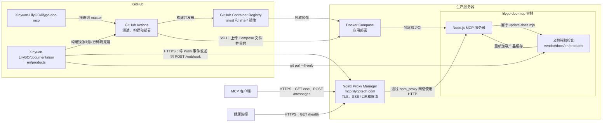

# lilygo-doc-mcp

[English](README.md) | 简体中文

面向 [LILYGO](https://www.lilygo.cc) 产品文档的 MCP 服务器，通过[模型上下文协议（Model Context Protocol）](https://modelcontextprotocol.io)将 LILYGO 硬件文档以结构化工具的形式提供给大语言模型客户端。

文档来自 [Xinyuan-LilyGO/documentation](https://github.com/Xinyuan-LilyGO/documentation) 的本地稀疏 Git 检出。运行时不调用 GitHub API，因此不受 API 速率限制；文档可通过 GitHub Webhook 自动保持更新。

## 在线服务

生产服务提供以下公共端点：

| 端点 | 方法 | 说明 |
|------|------|------|
| [https://mcp.lilygotech.com/sse](https://mcp.lilygotech.com/sse) | `GET` | 供 MCP 客户端连接的 MCP SSE 端点。 |
| [https://mcp.lilygotech.com/health](https://mcp.lilygotech.com/health) | `GET` | 健康检查端点，返回 `{ status, products }`。 |
| [https://mcp.lilygotech.com/webhook](https://mcp.lilygotech.com/webhook) | `POST` | 用于更新文档检出的 GitHub Push Webhook。 |

使用以下配置将 MCP 客户端连接到在线服务：

```json
{
  "mcpServers": {
    "lilygo-docs": {
      "type": "sse",
      "url": "https://mcp.lilygotech.com/sse"
    }
  }
}
```

SSE 传输会自动发布包含会话 ID 的 `https://mcp.lilygotech.com/messages?sessionId=...` 端点。该端点由 MCP 客户端管理，请勿手动配置或调用。

Webhook URL 是公开的，但仅用于接收 GitHub 的 `POST` 请求。公开该端点前必须配置 `GITHUB_WEBHOOK_SECRET`，并在 GitHub Webhook 设置中使用相同的值；该变量为空时，服务器会跳过签名验证。

## 架构



GitHub Actions 只部署 MCP 应用，不部署 Nginx Proxy Manager；生产服务器必须预先提供 NPM 和外部 `npm_proxy` 网络。有效的 Push Webhook 会立即返回 `202 Accepted`，随后服务器异步更新稀疏检出并重新加载内存中的产品缓存。

## 快速开始

### 1. 克隆并安装

```bash
git clone https://github.com/Xinyuan-LilyGO/lilygo-doc-mcp.git
cd lilygo-doc-mcp
npm install
npm run docs:init
npm run build
```

`npm run docs:init` 只会将 `en/products` 文档子树克隆到 `vendor/docs`。

如需使用其他文档检出目录，请在执行命令前设置 `DOCS_REPO_DIR`：

```bash
DOCS_REPO_DIR=/path/to/documentation npm run docs:update
```

### 2. 启动服务器

```bash
PORT=3000 npm start
```

### 3. 连接 MCP 客户端

```json
{
  "mcpServers": {
    "lilygo-docs": {
      "type": "sse",
      "url": "http://localhost:3000/sse"
    }
  }
}
```

## 保持文档更新

### 手动更新

```bash
npm run docs:update
```

更新后重启服务器，也可以通过 Webhook 自动完成更新和重载。

### 通过 GitHub Webhook 自动更新

在 [Xinyuan-LilyGO/documentation](https://github.com/Xinyuan-LilyGO/documentation) 仓库中配置 Webhook：

1. 进入 **Settings → Webhooks → Add webhook**。
2. 将 **Payload URL** 设置为 `https://mcp.lilygotech.com/webhook`；自托管部署请使用对应域名下的 URL。
3. 将 **Content type** 设置为 `application/json`。
4. 将 **Secret** 设置为服务器上 `GITHUB_WEBHOOK_SECRET` 的实际值。
5. 选择 **Just the push event**。

使用 Webhook Secret 启动服务器：

```bash
GITHUB_WEBHOOK_SECRET=your-secret PORT=3000 npm start
```

请勿在 `GITHUB_WEBHOOK_SECRET` 为空时公开 `/webhook`，因为服务器在未配置 Secret 时会跳过签名验证。

文档仓库每次 Push 后，服务器将：

1. 运行 `node scripts/update-docs.mjs`。
2. 重新加载内存中的产品缓存。产品分类会被自动发现。

## 日志

服务器会记录 MCP SSE 连接、消息请求、断开连接和工具调用。工具调用日志包含工具名称和参数，但不记录返回的文档内容。

使用 Docker 查看日志：

```bash
docker logs -f lilygo-doc-mcp
```

## 工具

| 工具 | 说明 |
|------|------|
| `list_products` | 列出全部产品，并支持按系列、标签或关键字过滤。 |
| `get_product` | 获取完整产品文档和编程指南，也可指定章节（overview、quickstart、features、parameters、pins、faq）。 |
| `get_product_guide` | 获取独立的 `quick-start.md` 编程指南，包括 SDK 设置、依赖和代码示例。 |
| `search_products` | 在产品页和编程指南中执行全文搜索，并返回按相关性排序的摘要。 |
| `get_product_specs` | 提取结构化规格，包括关键特性、参数表和引脚表。 |

## 环境变量

| 变量 | 默认值 | 说明 |
|------|--------|------|
| `PORT` | `3000` | HTTP 服务器端口。 |
| `GITHUB_WEBHOOK_SECRET` | _空_ | 用于签名验证的 GitHub Webhook Secret。未设置时跳过签名检查。 |
| `DOCS_DIR` | `vendor/docs/en/products` | 本地文档目录。 |
| `DOCS_REPO_DIR` | `vendor/docs` | 本地文档 Git 检出目录，由 `docs:init`、`docs:update` 和 Webhook Push 更新。 |
| `DOCS_REPO_URL` | `https://github.com/Xinyuan-LilyGO/documentation.git` | 文档仓库 URL。 |
| `DOCS_REPO_BRANCH` | `master` | 文档仓库分支。 |
| `DOCS_SPARSE_PATH` | `en/products` | 需要提供服务的稀疏检出路径。 |

## Docker 部署

两种部署方式都要求安装 Docker Engine 和 Docker Compose 插件。请先在服务器上克隆本仓库，再选择其中一种方式部署。

### 方式一：独立部署

该方式适用于仅本机访问、局域网直接访问，或不需要外部反向代理的场景。它只使用 `compose.yaml`，并自动创建私有 Docker 网络，但不提供 TLS 终止。

创建运行时配置：

```bash
git clone https://github.com/Xinyuan-LilyGO/lilygo-doc-mcp.git
cd lilygo-doc-mcp
cp .env.example .env
```

启动服务前编辑 `.env`：

```dotenv
LILYGO_DOC_MCP_IMAGE=ghcr.io/xinyuan-lilygo/lilygo-doc-mcp:latest
LILYGO_DOC_MCP_BIND_ADDRESS=127.0.0.1
LILYGO_DOC_MCP_PORT=3000
GITHUB_WEBHOOK_SECRET=replace-with-a-random-secret
```

- 只有同一服务器上的软件需要访问时，保持 `LILYGO_DOC_MCP_BIND_ADDRESS=127.0.0.1`。
- 只有明确需要局域网直接访问，并且主机防火墙已正确限制访问范围时，才将其设置为 `0.0.0.0`。
- 公开 `/webhook` 前，将 `GITHUB_WEBHOOK_SECRET` 替换为强随机值。

例如，生成一个 32 字节的十六进制 Secret，并将输出写入 `.env`：

```bash
openssl rand -hex 32
```

拉取镜像并启动服务：

```bash
docker compose pull
docker compose up -d --wait
```

验证健康检查端点并查看服务状态：

```bash
curl http://127.0.0.1:3000/health
docker compose ps
docker compose logs --tail=100 lilygo-doc-mcp
```

更新或停止独立部署：

```bash
# 更新
docker compose pull
docker compose up -d --remove-orphans --wait

# 停止并删除容器
docker compose down
```

如果需要构建当前检出的源码，而不是拉取已发布镜像：

```bash
docker compose -f compose.yaml -f compose.local.yaml up -d --build --wait
```

### 方式二：使用 Nginx Proxy Manager 部署

该方式用于提供公共端点 `https://mcp.lilygotech.com`。Nginx Proxy Manager（NPM）作为服务器级服务独立运行，`compose.npm.yaml` 则负责将本应用接入 NPM 的共享 Docker 网络。

启动任一 Compose 栈之前，先创建共享网络：

```bash
docker network inspect npm_proxy >/dev/null 2>&1 || docker network create npm_proxy
```

NPM 本身也必须加入该网络。推荐在 NPM 的 Compose 配置中加入外部网络，然后重新创建 NPM 服务，以便持久保存网络配置：

```yaml
services:
  app:
    networks:
      - default
      - npm_proxy

networks:
  npm_proxy:
    external: true
    name: npm_proxy
```

NPM 服务通常名为 `app`；如果实际服务名称不同，请使用实际名称。部署本应用前，先应用 NPM Compose 配置变更：

```bash
cd /opt/nginx-proxy-manager
docker compose up -d
```

然后准备本应用的运行时配置：

```bash
git clone https://github.com/Xinyuan-LilyGO/lilygo-doc-mcp.git
cd lilygo-doc-mcp
cp .env.example .env
```

在 `.env` 中保持 `LILYGO_DOC_MCP_BIND_ADDRESS=127.0.0.1`，选择所需的主机端口，并将 `GITHUB_WEBHOOK_SECRET` 替换为强随机值。使用两个 Compose 文件启动应用：

```bash
docker compose -f compose.yaml -f compose.npm.yaml pull
docker compose -f compose.yaml -f compose.npm.yaml up -d --wait
```

服务会同时加入自己的私有默认网络和外部 `npm_proxy` 网络。NPM 通过容器名称和容器端口访问服务，因此主机回环地址绑定不会阻止代理访问。

使用以下转发设置创建 NPM Proxy Host：

| 设置 | 值 |
|------|----|
| Domain Names | `mcp.lilygotech.com` |
| Scheme | `http` |
| Forward Hostname / IP | `lilygo-doc-mcp` |
| Forward Port | `3000` |

在 NPM 中配置 SSL 证书并启用 Force SSL。为了保证长时间 SSE 连接可靠，在 Proxy Host 的 **Advanced** 配置中加入：

```nginx
proxy_buffering off;
proxy_cache off;
proxy_read_timeout 3600s;
proxy_send_timeout 3600s;
```

推荐使用以下 NPM 全局配置限制 SSE 并发连接数和消息请求速率。将其保存到 NPM 安装目录下的 `data/nginx/custom/http.conf`，例如 `/opt/nginx-proxy-manager/data/nginx/custom/http.conf`：

```nginx
map "$host:$uri" $mcp_sse_ip_key {
    default "";
    "mcp.lilygotech.com:/sse" $binary_remote_addr;
}

map "$host:$uri" $mcp_sse_total_key {
    default "";
    "mcp.lilygotech.com:/sse" $host;
}

map "$host:$uri" $mcp_message_key {
    default "";
    "mcp.lilygotech.com:/messages" $binary_remote_addr;
}

limit_conn_zone $mcp_sse_ip_key zone=mcp_sse_ip:10m;
limit_conn_zone $mcp_sse_total_key zone=mcp_sse_total:10m;
limit_req_zone $mcp_message_key zone=mcp_messages:10m rate=600r/m;

limit_conn mcp_sse_ip 10;
limit_conn mcp_sse_total 500;
limit_req zone=mcp_messages burst=60 nodelay;

limit_conn_status 429;
limit_req_status 429;
```

该配置允许每个客户端 IP 最多建立 10 个并发 `/sse` 连接，全部客户端合计最多建立 500 个 `/sse` 连接；每个客户端 IP 的 `/messages` 请求平均速率限制为每分钟 600 次，并允许最多 60 次突发请求。其他主机和路径会得到空的映射键，因此不会计入这些限制。

如果使用其他域名，请在加载配置前替换全部三处 `mcp.lilygotech.com`。修改后验证并重新加载 NPM：

```bash
cd /opt/nginx-proxy-manager
docker compose exec app nginx -t
docker compose restart app
```

NPM Compose 服务通常名为 `app`；如果本地服务名称不同，请相应调整命令。

NPM 重新加载后，验证公共端点：

```bash
curl https://mcp.lilygotech.com/health
docker compose -f compose.yaml -f compose.npm.yaml ps
```

更新或停止该部署时，始终同时指定两个 Compose 文件：

```bash
# 更新
docker compose -f compose.yaml -f compose.npm.yaml pull
docker compose -f compose.yaml -f compose.npm.yaml up -d --remove-orphans --wait

# 停止并删除应用容器
docker compose -f compose.yaml -f compose.npm.yaml down
```

## GitHub Actions 部署

`.github/workflows/deploy.yml` 工作流会在 Pull Request 中运行测试。代码推送到 `master` 后，工作流会运行测试，将 `latest` 和 `sha-*` 镜像发布到 GHCR，然后使用包含 `compose.npm.yaml` 的**方式二**将 `latest` 镜像部署到生产服务器。也可以通过 **Run workflow** 手动启动；请选择 `master` 分支以执行发布和部署任务。

### GitHub Environment 配置

进入 **Settings > Environments > New environment**，创建名为 `production` 的 Environment，然后配置以下 Environment Secrets：

| Secret | 必填 | 说明 |
|--------|------|------|
| `DEPLOY_HOST` | 是 | 生产服务器的主机名或 IP 地址，不包含 URL Scheme。 |
| `DEPLOY_USER` | 是 | 用于部署的 SSH 用户。 |
| `DEPLOY_SSH_KEY` | 是 | 专用于部署、无密码短语的完整 OpenSSH 私钥。将对应公钥安装到部署用户的 `~/.ssh/authorized_keys`。 |
| `DEPLOY_KNOWN_HOSTS` | 是 | 生产 SSH 服务器可信的 `known_hosts` 条目。 |

默认值不适用时，配置以下 Environment Variables：

| Variable | 必填 | 默认值 | 说明 |
|----------|------|--------|------|
| `DEPLOY_PORT` | 否 | `22` | 生产服务器 SSH 端口。 |
| `DEPLOY_PATH` | 否 | `/opt/lilygo-doc-mcp` | 接收部署文件并保存持久化 `.env` 的目录。 |

`GITHUB_TOKEN` 由 GitHub Actions 自动创建，用于发布容器镜像，无需另行添加 Secret。工作流仅授予该操作所需的 `contents: read` 和 `packages: write` 权限。

在可信计算机上生成 `DEPLOY_KNOWN_HOSTS`，验证服务器指纹后，再将输出保存为 GitHub Secret：

```bash
ssh-keyscan -p 22 -H your-server.example.com
```

如果 SSH 使用其他端口，请用已配置的 `DEPLOY_PORT` 替换 `22`。

### 生产服务器要求

首次通过 Actions 部署前，请确认：

- 已安装 Docker Engine 和 Docker Compose 插件。
- `DEPLOY_USER` 无需交互式密码即可运行 `docker`。
- `DEPLOY_USER` 可以创建并写入 `DEPLOY_PATH`；如果该用户无法写入父目录，请预先创建部署目录。
- GHCR Package 是公开的，或者服务器已经登录 `ghcr.io` 并拥有镜像拉取权限。
- Nginx Proxy Manager 已加入名为 `npm_proxy` 的外部 Docker 网络，并完成上文所述的 Proxy Host 配置。
- `mcp.lilygotech.com` 的 DNS 已指向生产服务器，并且 NPM 可以使用入站端口 `80` 和 `443`。

首次部署会创建 `DEPLOY_PATH/.env` 并生成 `GITHUB_WEBHOOK_SECRET`，后续部署会保留该文件。如需修改发布端口、镜像或 Webhook Secret 等运行时设置，请编辑服务器上的 `.env`：

```bash
cd /opt/lilygo-doc-mcp
vi .env
docker compose -f compose.yaml -f compose.npm.yaml up -d --remove-orphans --wait
```

如果自定义了 `DEPLOY_PATH`，请使用对应路径。对于 Fork 或重命名后的仓库，请在服务器端 `.env` 中将 `LILYGO_DOC_MCP_IMAGE` 设置为该仓库发布的镜像，例如 `ghcr.io/owner/lilygo-doc-mcp:latest`。

## 许可证

MIT
